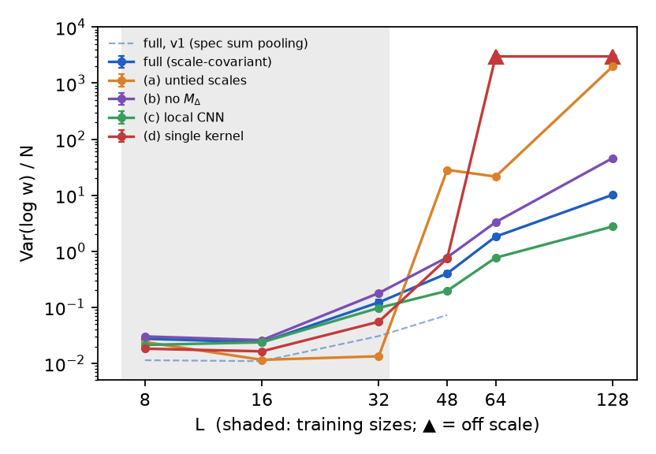
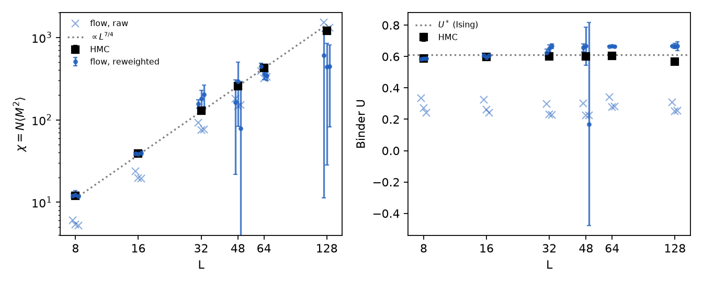
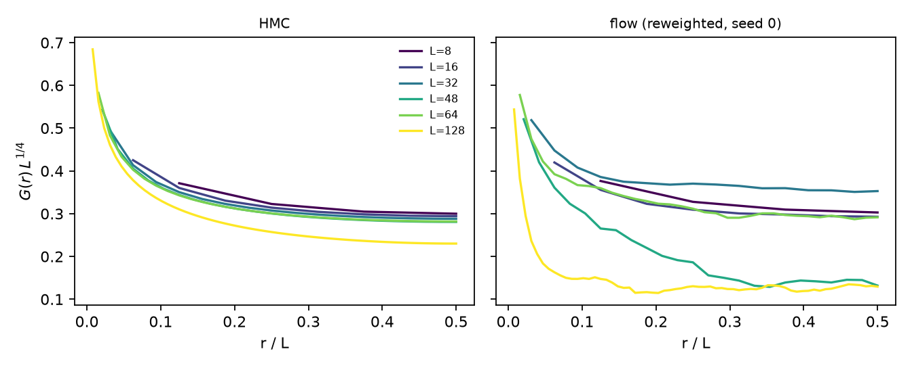
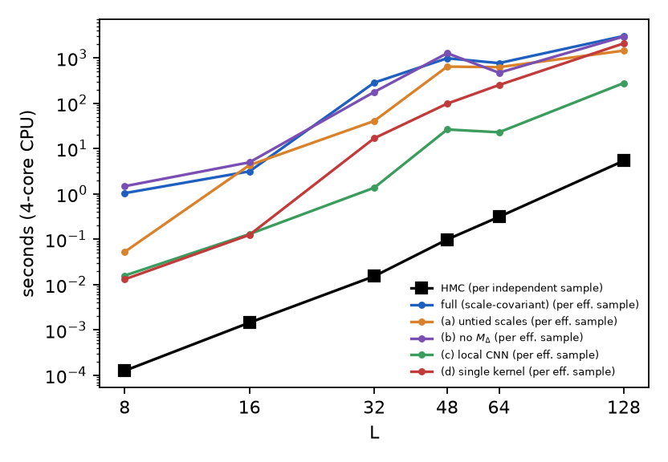

# Scale-covariant neural-operator flow for 2D φ⁴ at criticality: first results

*These results come from a 4-core CPU with no GPU. The model is small (per-scale width 8) and each
run trains for 2000 Adam steps. Treat them as a test of the design, not a converged sampler. The code,
unit tests and raw numbers are in this directory (see the [README](../README.md)).*

## 1. Setup

- **Theory.** The action is S = Σ[Σ_μ(φ_{x+μ}−φ_x)² + m²φ² + λφ⁴] with m² = −4, on periodic L×L lattices.
- **Critical coupling (M0).** HMC Binder-cumulant crossings for L = 16/32 and L = 32/64 both give
  λ ≈ 4.245, with U ≈ 0.595 at the crossings (`results/m0_scan.json`). All runs use λ = 4.25.
- **Ground truth.** HMC at λ = 4.25 (`results/hmc_reference.json`):
  - χ grows with exponent 2 − η = 1.717 over L ≤ 64 (Ising: 1.75).
  - U = 0.587, 0.599, 0.602, 0.601 and 0.604 for L = 8 to 64 (Ising U* = 0.611).
  - At L = 128, U falls to 0.569 ± 0.007. So λ = 4.25 is very slightly on the disordered side of the
    true λ_c, which only becomes visible at the largest lattice.
  - The integrated autocorrelation time of M² is 6, 27, 100, 245, 391 and 900 trajectories for
    L = 8 … 128, which gives z ≈ 1.8.
- **Model.** Everything follows handout §3, built on bijx (`FreeTheoryScaling` base, `Chain`,
  `ApplyBijection`):
  - free-field base with m₀ = 2/L;
  - a Z₂-odd CNF whose velocity is τ(δ_x, c_x, M, t);
  - one shared radial kernel network evaluated at 2^{k/2}-spaced scales, with untied UV and IR ends;
  - an exact divergence from one forward-mode JVP;
  - the M_Δ layer.
- **Training.** Reverse KL on L ∈ {8, 16, 32} with a curriculum, RK4 with 8 steps, in float32.
- **Evaluation.** Float64, with the number of RK4 steps doubled until log q changes by less than 10⁻³
  per configuration (16–64 steps were needed). Held-out sizes are L = 48, 64 and 128.

## 2. Deviations found necessary (all flagged in the code and README)

1. **Global magnetization input to τ.** Every kernel sums to zero and δ removes the local mean, so
   the velocity of §3.3 cannot see M. It therefore cannot build the double-peaked P(M) found at
   criticality. Feeding M to τ keeps the divergence exact: the same JVP with tangent 1/N on M gives
   the true diagonal. At L = 8, this cut Var(log w)/N from about 0.5 to 0.045 in 600 steps.
2. **Scale aggregation (v2).** With the handout's aggregation (v1: c = Σ_k h_k, and kernels made
   zero-sum by subtracting the mean over the whole torus), the RMS of c on base samples grows from
   0.7 to 20.6 between L = 8 and L = 128. There are two reasons:
   - each h_k has a nonzero mean, so the sum grows with the number of scales K;
   - a globally zero-sum kernel gives R_s = (local average at scale s) − (global mean), whose
     variance grows like log(L/s) for a log-correlated field.

   v2 changes both, and the RMS of c becomes flat (0.107 → 0.112, test 8):
   - each kernel is zero-sum over its own scale, making it a band-pass (wavelet) kernel;
   - the shared middle scales are averaged, and the UV/IR end scales get separate readouts.
3. **Smooth kernel with k(0) = 0.** This makes the L → 2L response covariance hold to about 10⁻³
   inside the window (test 7). Before the change, the error was about 12% at s = 2.

## 3. Results

Var(log w)/N, measured in float64 from 2048, 1024, 512, 256, 128 and 64 independent samples at
L = 8, 16, 32, 48, 64 and 128. Held-out sizes are marked \*. Errors are the SEM over seeds, or a
bootstrap error for single-seed runs.

| variant | seeds | Delta | L=8 | L=16 | L=32 | L=48* | L=64* | L=128* |
|---|---|---|---|---|---|---|---|---|
| full (scale-covariant) | 3 | 0.235 ± 0.005 | 0.0275 ± 0.0021 | 0.0237 ± 0.0022 | 0.122 ± 0.013 | 0.402 ± 0.037 | 1.83 ± 0.18 | 10.2 ± 0.82 |
| (a) untied scales | 1 | -0.011 | 0.024 ± 0.0031 | 0.0116 ± 0.0008 | 0.0134 ± 0.0017 | 28.3 ± 4.4 | 21.6 ± 3 | 2.0×10³ |
| (b) no $M_\Delta$ | 1 | 0.000 | 0.0302 ± 0.0049 | 0.026 ± 0.0028 | 0.179 ± 0.036 | 0.777 ± 0.17 | 3.31 ± 1.3 | 46 ± 16 |
| (c) local CNN | 1 | -0.023 | 0.0213 ± 0.0012 | 0.0237 ± 0.004 | 0.0976 ± 0.028 | 0.197 ± 0.063 | 0.768 ± 0.38 | 2.77 ± 0.98 |
| (d) single kernel | 1 | -0.037 | 0.0183 ± 0.0005 | 0.0164 ± 0.0016 | 0.0552 ± 0.011 | 0.743 ± 0.08 | 7×10⁹ | 6×10¹⁸⁷ |

**Transfer (metric 1): not achieved at this budget.** Every variant's Var(log w)/N grows
systematically on held-out lattices, and the full model grows 3–5× per step in L beyond 32 (0.12 → 0.40 → 1.8 → 10).
It is already higher at L = 32 than at L = 8 and 16, so part of the growth is under-training at the
largest training size, not just a failure to extrapolate.

**Ablations.** Ranked by held-out performance:

| rank | variant | behaviour on held-out sizes |
|---|---|---|
| 1 | (c) local CNN, fixed 9×9 receptive field | best. A purely local velocity has nothing that must extrapolate. |
| 2 | full model | 2–4× worse than (c): 0.40 vs 0.20 at L = 48, 1.8 vs 0.77 at L = 64, 10 vs 2.8 at L = 128 |
| 3 | (b) no M_Δ | about 2× worse than the full model at L = 48 and 64, and 4.5× worse at L = 128, so the M_Δ layer helps |
| 4 | (d) single kernel (Máté & Fleuret style) | best of all at the training sizes, but 1.8× worse than full at L = 48, then Var/N ≈ 7×10⁹ at L = 64 (its distance MLP extrapolates badly) |
| 5 | (a) untied scales | catastrophic: 70× worse than full at L = 48 and 200× at L = 128. Its new scales have untrained kernels. |

The comparison of (a) and (d) against the full model is the one clear positive result: sharing one
kernel network across scales is what makes the model evaluable at all on larger lattices. The full
model does **not** beat (c), so success criterion 5 fails against that baseline.

**v1 vs v2.** The v1 full model, with the handout's aggregation, had *lower* Var(log w)/N than v2 at
every size it was evaluated on (0.011, 0.011, 0.031 and 0.073 for L = 8 to 48). Making the
conditioner statistics independent of L was therefore not enough on its own for transfer, and the
v1 → v2 change did not improve it. The drift of c was a real design flaw, but it was not the
dominant one.

**Physics (metric 2).**
- At L = 8 and 16, the reweighted χ and U agree with HMC within errors (for example, at L = 8 the v1
  full model gives χ = 11.82 ± 0.20 and U = 0.587 ± 0.003, against 11.89 ± 0.03 and 0.5871 ± 0.0007).
- The *raw* flow has U ≈ 0.25–0.35, against 0.60. The flow barely produces the double-peaked P(M),
  and importance weights do the correction.
- At held-out sizes, ESS falls to about 1% and the reweighted estimates are biased (U ≈ 0.62–0.67),
  with unreliable jackknife errors.

**Learned Δ (metric 3).**
- v2 full model: Δ = 0.235 ± 0.005 (mean ± standard deviation) over 3 seeds.
- Seeds agree to within 0.01. Δ becomes clearly nonzero as soon as L = 32 enters the curriculum,
  passing through Δ_σ = 0.125 early in that phase, but it settles at about 0.23, not at 1/8.
- v1 (sum aggregation) instead drifts to −0.04. An M_Δ layer with an extra UV-untied correction
  (`mdelta_uv`) also went negative.
- So Δ is not a clean estimate of Δ_σ here. At L ≤ 32 the layer also absorbs the crossover from
  free-field to Ising behaviour, and it trades off against the nonlinear CNF. Decision 3 of the
  handout ("the CNF cannot change exponents") only holds for an exactly covariant CNF.

**Cost (metric 4).** At the training sizes, flow sampling costs are 0.02–1 s/sample (float64, one
core). HMC costs 10⁻⁴–10⁻² s per independent sample, even after critical slowing down. At this model
size and on CPU, HMC wins by orders of magnitude at every L; see `figures/cost_vs_L.png`.

## 4. What I would do next

1. **Train longer and bigger on a GPU.** Training-time Var(log w)/N at L = 32 was still falling
   when training stopped. The spec-size model (B = 128, E = 8, H = 32, C = 16) runs from the same
   code with one config change.
2. **Replace the linear M_Δ with a coarse-to-fine or zero-mode-aware layer.** The raw P(M) is the
   largest defect. One option is a dedicated invertible 1D map on the zero mode, which has an exact
   Jacobian.
3. **Regularize the kinetic energy of the flow.** Evaluation needed 32–64 RK4 steps while training
   used 8. A kinetic-energy (RNODE-style) penalty would bring the trained and evaluated maps closer.
4. **Test covariance of the trained velocity itself.** Upsampling tests on the trained v(φ) would
   show which part of the network breaks scale sharing.
